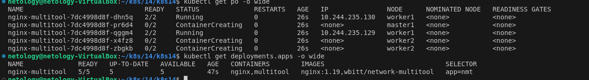
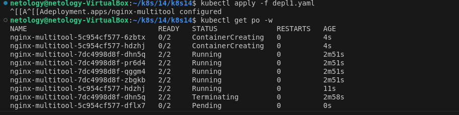
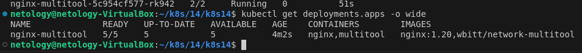
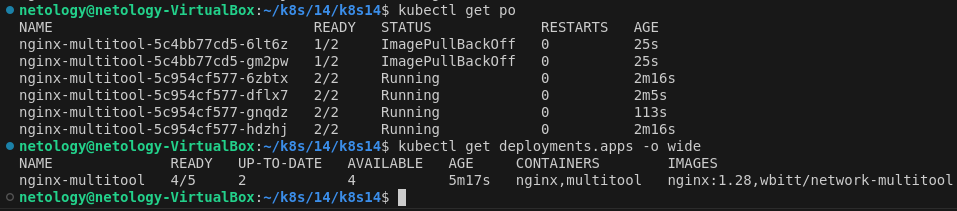
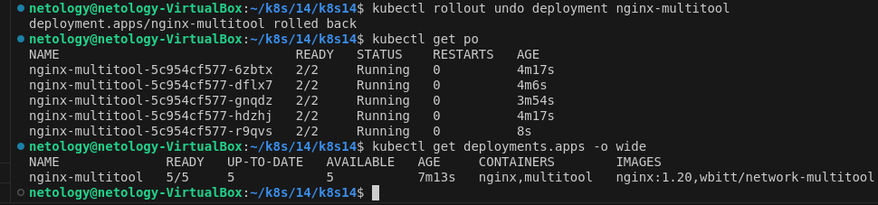
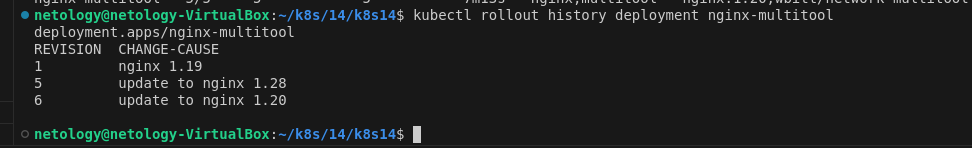

### 1 

Rolling update с указанием maxSurge: 20% maxUnavailable: 20% запуск апдейта в менее нагруженный момент времени(именно в этот момент попадут 20%)
таким образом обновление пройдет с максимальной отказоустойчивостью сервиса

### 2 

